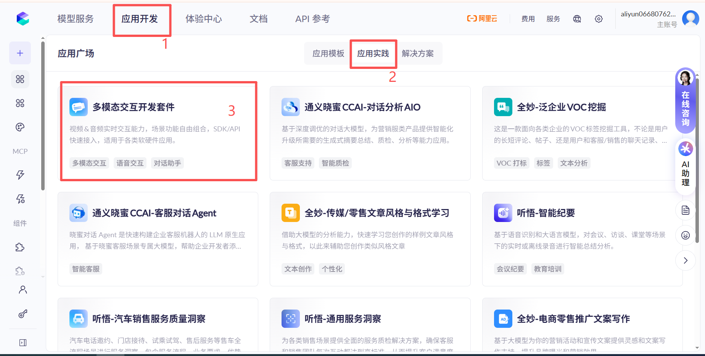
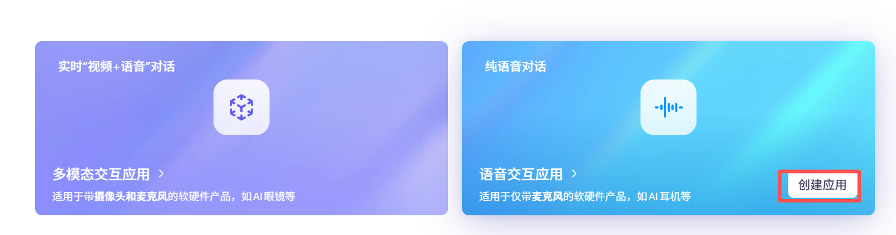
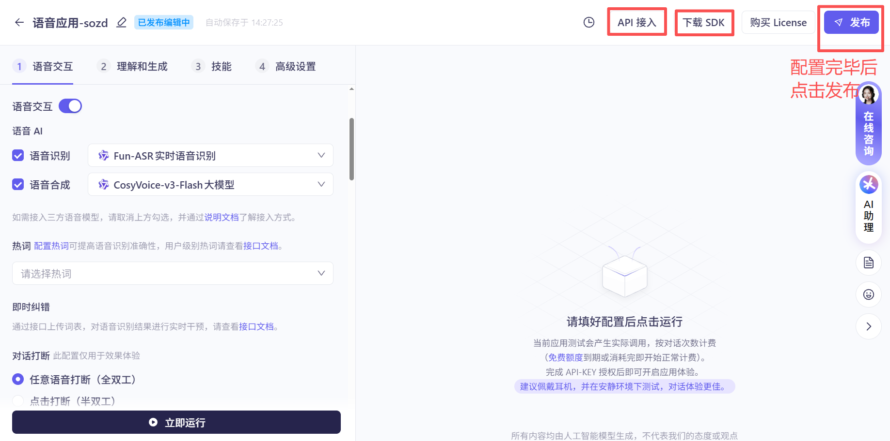
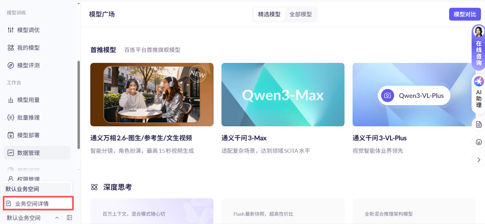
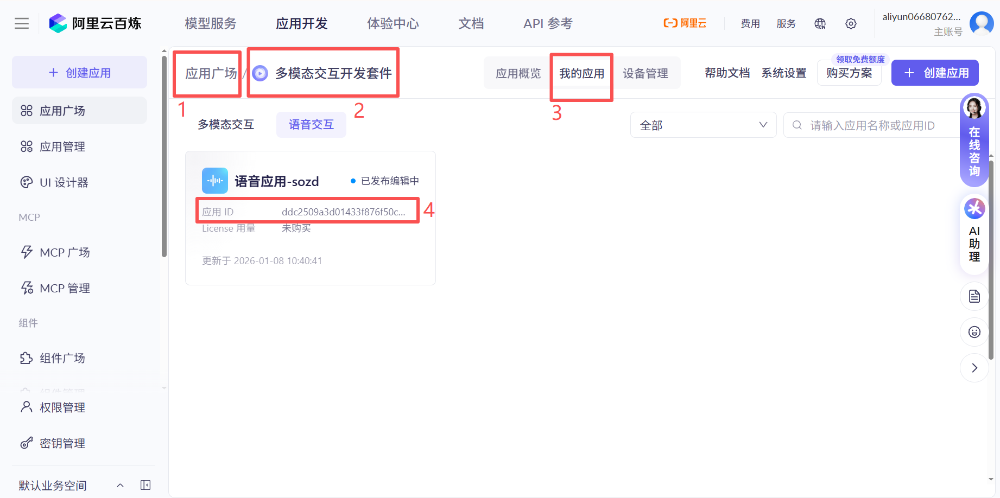
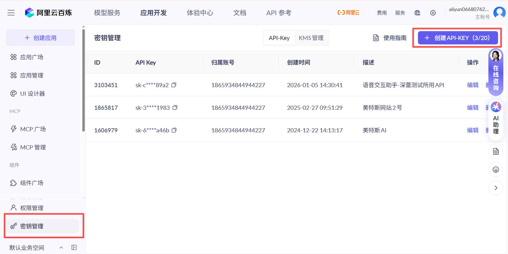

# VS680 SoC阿里多模态大模型能力对接实践

## 1. 阿里开发平台准备

### 1.1 开发者账号与权限开通
> 提示：首先在阿里云百炼控制台完成账号与权限准备。

<p align="center">
	<a href="https://bailian.console.aliyun.com/?spm=ntm.workbench-commodities-cloud-paydone.0.0.28ae19afdUlZld&tab=app#/app-market/lightApplication" target="_blank">
		
	</a>
	<br/>
	<sub>点击按钮打开阿里百炼应用市场</sub>
  
</p>

步骤建议：

1. 登录/注册阿里云账号，确保账号已完成企业或个人实名认证（如需）。
2. 在"应用广场" -> "应用实践" 中定位多模态交互开发套件。
<p align="center">
	
	<br/>
	<sub>多模态开发套件入口</sub>
</p>

3. 创建“多模态交互应用”或“语音交互应用”， 选择对应模板（可以随意选一个，进入后可以自行为模型应用配置不同的插件）。
<p align="center">
	
	<br/>
	<sub>多模态开发套件入口</sub>
</p>

4. 进行模型配置，可以添加不同的应用功能，插件等。配置好后点击发布应用。
<p align="center">
	
	<br/>
	<sub>阿里百炼应用模型配置</sub>
</p>


### 1.2 获取 Workspace ID / API Key / App ID（模板）

> 目标：明确三项关键信息的来源、记录方式与安全存放位置。

获取路径（以控制台实际页面为准）：

- Workspace ID：进入默认业务空间 -> 业务空间详细 ，复制 Workspace ID。
<p align="center">
	
	<br/>
	<sub>workspaceid 获取</sub>
</p>

- App ID：在“应用详情”页可见 App ID；如未创建，请先新建应用再获取。
<p align="center">
	
	<br/>
	<sub>app id获取</sub>
</p>

- API Key（或 AK/SK/Token）：在“API 接入/访问凭证/密钥管理”等入口创建；注意首次只显示一次明文，请妥善保存。
<p align="center">
	
	<br/>
	<sub>api key获取</sub>
</p>

建议存放（Android 工程，二选一）：

```
# 选项 A：测试DEMO可直接硬编码在文件中快速测试
private static String workspaceId = "your_workspace_id";
private static String apiKey = "your_app_id";
private static String appId = "your_api_key_or_token";

# 选项 B：local.properties（默认不提交到仓库） <-- TODO 
ALIYUN_WORKSPACE_ID=your_workspace_id
ALIYUN_APP_ID=your_app_id
ALIYUN_API_KEY=your_api_key_or_token
```

安全提示：

- `local.properties` 默认在 `.gitignore` 中；请勿把密钥提交到仓库或明文写入代码。
- 生产环境优先使用服务端颁发的短期 Token，并设置最小权限范围与有效期。


## 2. 初期调试开发记录

### 2.1 添加阿里官方插件
### 2.2 添加外挂知识库
### 2.3 添加阿里官方百炼应用
### 2.4 智能语音指令

1. 调整音量大小
2. 事件提醒功能

### 2.5 开启唤醒词与自动休眠


