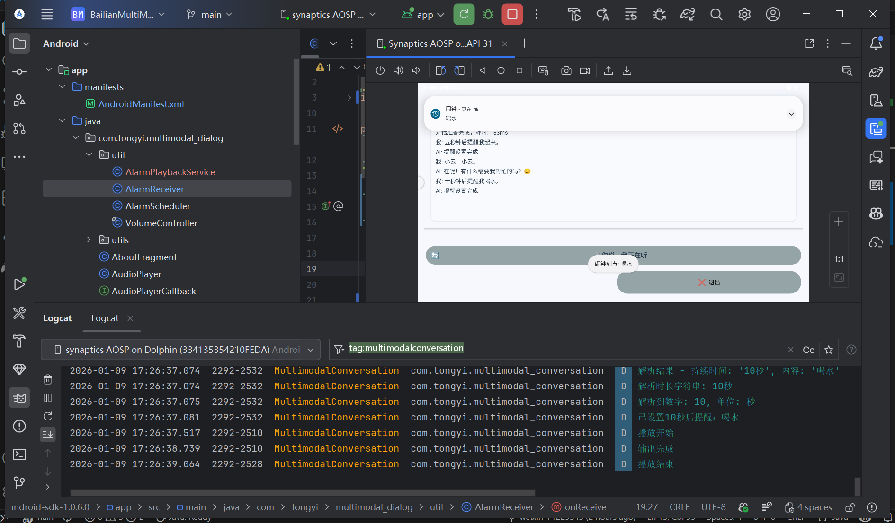

# VS680 SoC阿里多模态大模型能力对接实践

## 1. 阿里开发平台准备

### 1.1 开发者账号与权限开通
> 提示：首先在阿里云百炼控制台完成账号与权限准备。

<p align="center">
	<a href="https://bailian.console.aliyun.com/?spm=ntm.workbench-commodities-cloud-paydone.0.0.28ae19afdUlZld&tab=app#/app-market/lightApplication" target="_blank">
		
	</a>
	<br/>
	<sub>点击按钮打开阿里百炼应用市场</sub>
  
</p>

步骤建议：

1. 登录/注册阿里云账号，确保账号已完成企业或个人实名认证（如需）。
2. 在"应用广场" -> "应用实践" 中定位多模态交互开发套件。
<p align="center">
	
	<br/>
	<sub>多模态开发套件入口</sub>
</p>

3. 创建“多模态交互应用”或“语音交互应用”， 选择对应模板（可以随意选一个，进入后可以自行为模型应用配置不同的插件）。
<p align="center">
	
	<br/>
	<sub>多模态开发套件入口</sub>
</p>

4. 进行模型配置，可以添加不同的应用功能，插件等。配置好后点击发布应用。
<p align="center">
	
	<br/>
	<sub>阿里百炼应用模型配置</sub>
</p>


### 1.2 获取 Workspace ID / API Key / App ID（模板）

> 目标：明确三项关键信息的来源、记录方式与安全存放位置。

获取路径（以控制台实际页面为准）：

- Workspace ID：进入默认业务空间 -> 业务空间详细 ，复制 Workspace ID。
<p align="center">
	
	<br/>
	<sub>workspaceid 获取</sub>
</p>

- App ID：在“应用详情”页可见 App ID；如未创建，请先新建应用再获取。
<p align="center">
	
	<br/>
	<sub>app id获取</sub>
</p>

- API Key（或 AK/SK/Token）：在“API 接入/访问凭证/密钥管理”等入口创建；注意首次只显示一次明文，请妥善保存。
<p align="center">
	
	<br/>
	<sub>api key获取</sub>
</p>

建议存放（Android 工程，二选一）：

```java
# 选项 A：测试DEMO可直接硬编码在文件中快速测试
private static String workspaceId = "your_workspace_id";
private static String apiKey = "your_app_id";
private static String appId = "your_api_key_or_token";

# 选项 B：local.properties（默认不提交到仓库） <-- TODO 
ALIYUN_WORKSPACE_ID=your_workspace_id
ALIYUN_APP_ID=your_app_id
ALIYUN_API_KEY=your_api_key_or_token
```


## 2. 初期调试开发记录

### 2.1 MCP插件功能
 1. 添加阿里官方插件
 2. MCP功能
### 2.2 添加外挂知识库

1. **如何添加**


### 2.3 添加阿里官方百炼应用

1. **如何添加**
> 进入应用开发 ➡️ 全部应用 ➡️ 多模态交互开发套件 ➡️ 我的应用 ➡️ 配置应用。点击百炼应用中的`+`。
<p align="center">
	
	<br/>
	<sub>如何添加百炼应用</sub>
</p>

2. **检验效果**
故事模式效果展示，需要先对模型说“打开故事模式”。随后模型会调用故事模式agent，同样的模型声音也会改变。
<p align="center">
	
	<br/>
	<sub>故事模式展示</sub>
</p>


### 2.4 智能语音指令 (设备控制功能)
> 如果需要添加智能语音指令或插件，需要到在我的应用 ➡️ 配置应用 ➡️ 大模型服务控制台进行自行添加。（如下图）
<p align="center">
	
	<br/>
	<sub>智能语音指令配置示意图</sub>
</p>

 进入编辑指令，查阅/编辑对应的指令参数。可以看到 ```指令名称、指令说明、指令示例、参数名称、下发指令```。具体可以关注并记录“下发指令”的参数名称，也可以进行客制化修改。

 假设需要添加的功能为“音量提高”，则可以添加`INCREASE_DEFAULT_volume`到`executeCommand`也就是命令执行函数中进行具体的实现。

1. **调整音量大小**

对模型说出指令“提高音量”后，可以在使用`Log.d()`在`Logcat`中打印出大模型回传的包内容。
```json
{
	"function":
	{
		"arguments":"{}",
		"name":"INCREASE_DEFAULT_volume"
		},
	"type":"FUNCTION"
}
```
拆分包的内容进行函数功能实现，调用`AudioManager`进行函数实现。函数执行完毕后，需要进行额外两个步骤：更改运行状态以及向服务器回调发送命令执行完毕的反馈。否则程序会卡在“思考中”并且无法恢复后续指令。大致实现思路如下。

```java
case "INCREASE_DEFAULT_volume": {
                        // 固定增加音量
                        final int step = 3;
                        VolumeController.adjustByStep(this, step);
                        // 获取当前音量
                        int cur = VolumeController.getCurrent(this);
                        int max = VolumeController.getMax(this);
                        // DEBUG LOG
                        Log.d(TAG, "音量固定增加(" + step + "): " + cur + "/" + max);
                        // DEBUG SHOW TOAST
                        runOnUiThread(() -> Toast.makeText(this, "音量已增加" + step + "(" + cur + "/" + max + ")", Toast.LENGTH_SHORT).show());
                        // 更改运行状态
                        isExecutingCommand = false;
                        runOnUiThread(()->updateStateUI(currentState));
                        //Log.d(TAG, "isExecutingCommand 设置为 : " + isExecutingCommand + " || " + "currentState: " + currentState);

                        // 向服务器发送命令执行完成的反馈
                        multiModalDialog.requestToRespond("transcript", "音量已增加到 " + cur + "/" + max, null);
                        break;
                    }
```

 - 功能验证：对模型说“音量提高”后，可以成功调节音量大小。
 <p align="center">
	
	<br/>
	<sub>语音指令：音量提高示例</sub>
</p>

2. **事件提醒功能**

事件提醒功能的开发思路与上述相似。首先添加指令类型，编辑指令内容和形式。收到回调包的指令后需要调用`AlarmManager`进行函数具体功能实现。

 - 功能验证：对模型说“10秒钟后提醒我喝水”后，可以成功调用系统闹钟。
  <p align="center">
	
	<br/>
	<sub>语音指令：事件提醒功能示例</sub>
</p>

### 2.6 联网搜索功能
>启用此功能前需要在我的应用 ➡️ 配置应用 ➡️ 大模型控制台处开启"联网搜索"选项。

<p align="center">
	
	<br/>
	<sub>联网搜索功能示意</sub>
</p>

 - 验证执行操作：对模型发起查询，“帮我搜索南山区附近的咖啡店地址与评分”。
 - 返回结果：模型会询问具体要查询哪些店家，查询后可以正确返回大众点评的实时评分。
 - 返回问题：当模型查询时不会立刻返回结果，需要再次询问。


### 2.7 语音实时对话

1. **语音实时对话：**
<p align="center">
	
	<br/>
	<sub>语音实时对话示意</sub>
</p>

支持低延迟的流式语音通道，能够在用户说话时进行流式识别并同步生成模型回复的语音输出，适用于交互式语音助手与对话设备场景。常见能力包括唤醒词触发、回声消除与噪声抑制、流式识别（ASR）与流式合成（TTS）、以及边/云端混合部署以保证稳定性与隐私。

2. **开启唤醒词与自动休眠：**

<p align="center">
	
	<br/>
	<sub>支持唤醒词功能</sub>
</p>

支持语音唤醒功能，默认唤醒词为“小云小云”。如若超过Dialog timeout的时间没有收到说话声音，则需要重新说唤醒词唤醒。

```java
private boolean enableKeywordSpotting = true;
// 启用唤醒，默认唤醒词为"小云小云"
if (enableKeywordSpotting){
	//如果开启唤醒，那么需要先启动录音
	MultiModalDialog.wsUseInternalVAD = true;
	multiModalDialog.enableKWS(true, false);
}
```

如需开启``KWS``也就是key word wake up功能，需要在初始化``MultiModalDialog``的时候使用上述代码。并且把```enableKeywordSpotting```设置为``true``。


### 2.8 长期记忆功能

1. 语音实时对话 ✔
2. 外挂知识库 ✔
3. MCP插件功能 ✔
4. 长期记忆功能 ✔
5. 事件提醒功能 ✔
6. 视觉理解功能
7. 设备控制功能 ✔
8. 联网搜索功能 ✔
9. 意图识别功能

---

## 已知问题 / 待修复


- **问题编号**：ISSUE-001
- **标题**：进入故事模式后，无法打断模型讲故事。
- **描述**：当使用“打开故事模式”指令执行音量调整后，agent进入讲故事的模式，讲故事途中无法被打断，不会恢复到聆听状态。讲完故事后，刚才存储的指令会依次放出造成延迟卡顿。
- **复现步骤**：
	1. 唤醒设备并说“打开故事模式”，随后“讲儿童故事”。
	2. 观察 Logcat。
- **期望行为**：进入故事模式讲故事的时候可以被立刻打断。
- **实际行为 / 日志片段**：
```
// multiModalDialog.requestToRespond 调用日志
```


