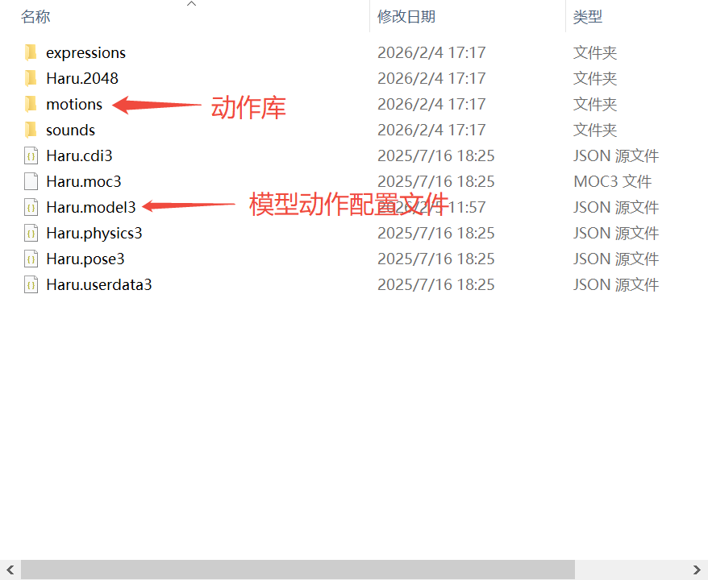

# 技术说明文档

## 1. 编译

1. 打开Android studio

2. 点击Sync Project with Gradle File.

## 2. Live 2D Model

Model素材来源于Live 2D，链接为[Live 2D](https://www.live2d.com/zh-CHS/learn/sample/)。免费下载模型数据集，在DEMO中使用的模型为`小春`。
模型文件下载后的格式为：
```bash
模型数据（cmo3）* 包含物理计算设置
基本动态（can3）
嵌入用文件一套（runtime文件夹）
・模型数据（moc3）
・动态数据（motion3.json）
・模型设定文件（model3.json）
・物理模拟设定文件（physics3.json）
・姿势设定文件（pose3.json）
・显示辅助文件（cdi3.json）
PSD文件（划分素材.psd）（导入.psd）
```


> 注：将运行时所需的最终资源放在 `assets/<model_name>/` 目录下，源 PSD 等可单独存档或放在设计资源库中。

### 典型目录组织（示例）

<p align="center">
    
    <br/>
    <sub>model file context</sub>
</p>

### 模型运行

1. `live2d.html`：通过安卓的`WebView`组件，调用`WebView.evaluateJavascript`执行JS，再利用浏览器内核提供的WebGL技术，讲Live2D模型渲染到应用中。可以利用此方法在`安卓原生`和`JS`之间实现操控。

2. 在文件`live2d/lib`中,可以看到Web端的SDK，将Live2d转换成WebGL可以执行的绘图指令。


### 模型动作讲解

1. `motions`文档为动作文档，在`Haru.model3.json`中找到“Motions”。可以使用已经定义好的动作，或是可以自己创建动作。下一步在live2d.html中使用类似`model.motion('TapBody', 1)`来执行动作。

### 模型位置调整

> 当更换UI改变WebView Container的视图大小时，目前需要手动对模型进行正中心对准。

```javascript
    // live2d.html
    model.scale.set(0.05); // 缩放大小
    model.anchor.set(0.5, 0.5); // 视图中心点
    // 视图窗口位置，当模型展示不全的时候，可以尝试移动位置。
    model.position.set(app.renderer.width / 2 - 300, app.renderer.height * 0.1 + 40); 

```

